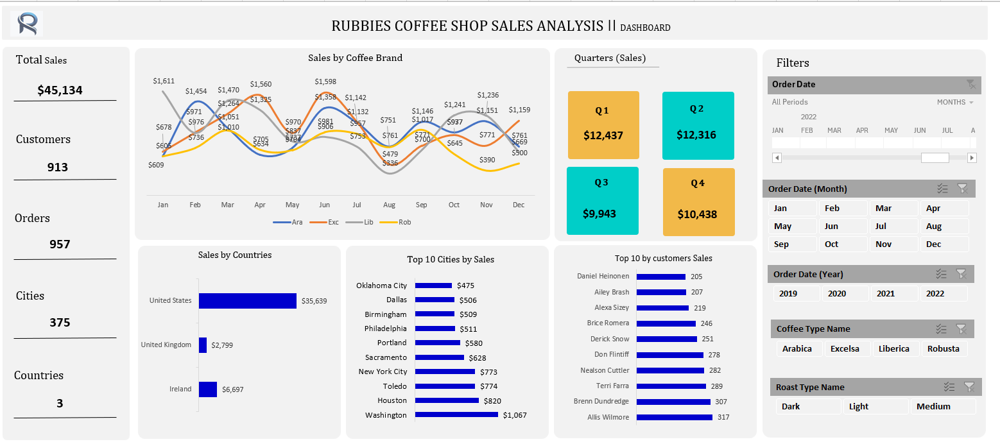
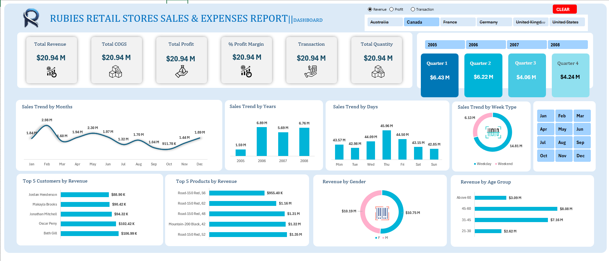
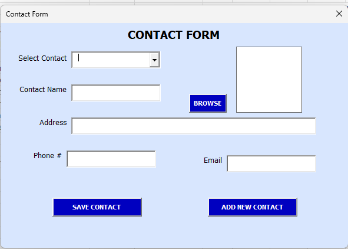

<!--Section 1: Introduce your self-->
## ABOUT ME

Hello! I'm Aluko Kayode, a data analyst, educator, and consultant with a passion for turning data into actionable insights. With experience across sales, operations, finance, and customer service, I help businesses solve challenges and unlock growth.

<!--Mention your top/relevant skills here - core and soft skills-->
## SKILLS

*As the Chief Analyst of SkillAhead Solutions Ltd, I provide consulting and training services for businesses and mentor aspiring analysts.*

**- ✅ Data Cleaning and Transformation.**
I provide in-depth analysis and tailored solutions to help you make data-driven decisions, optimize processes, and drive business growth. 

**- ✅ Staff Training & Development.**
I offer comprehensive training programs in data analysis, visualization, and data-driven decision-making. From beginner to advanced levels. 

<!--Section 2: List 3-4 key projects-->
## MY PROJECTS 

*A glimpse of some of the projects I've been working on.*

**Rubies Tea Shop Sales Data.**

The sinking of the Titanic is one of the most infamous shipwrecks in history.

[Read More](https://www.linkedin.com/pulse/predictive-modeling-hypothesis-testing-using-titanic-dataset-anietie/)

**Rubies Group of Stores Sales & Expenses Analysis.**

On April 15, 1912, during her maiden voyage, the widely considered “unsinkable” RMS Titanic sank after colliding with an iceberg. 

[Read More](https://www.linkedin.com/pulse/predictive-modeling-hypothesis-testing-using-titanic-dataset-anietie/)

**Contact Form.**

Unfortunately, there weren’t enough lifeboats for everyone onboard, resulting in the death of 1502 out of 2224 passengers and crew. 

<a href="17 How to Present Data to Executives by Anietie Etuk.pdf">Download the Report here (pdf file)</a>

**Madona Christmas Sales Data.**

Unfortunately, there weren’t enough lifeboats for everyone onboard, resulting in the death of 1502 out of 2224 passengers and crew. 

<a href="17 How to Present Data to Executives by Anietie Etuk.pdf">Download the Report here (pdf file)</a>

## CONTACT DETAILS

*Let’s connect and see how we can make a difference together!*
<table>
  <tbody>
    <tr>
      <td>📧</td>
      <td><a href="alukokayodepaul@gmail.com">alukokayodepaul@gmail.com</a></td>
    </tr>
    <tr>
      <td>📞</td>
      <td>(234) 816-937-8631</td>
    </tr>
    <tr>
      <td>📍</td>
      <td>Lagos, Nigeria</td>
    </tr>
    <tr>
      <td>⬇️</td>
      <td><a href="https://etuk123456.github.io/portfolio1/docs/Profile.pdf">Download my CV</a></td>
    </tr>
    <tr>
      <td>🌐</td>
      <td><a href="https://www.linkedin.com/in/kayode-aluko/">LinkedIn</a></td>
    </tr>
    <tr>
      <td>📺</td>
      <td><a href="https://www.youtube.com/">YouTube</a></td>
    </tr>
  </tbody>
</table>

   

